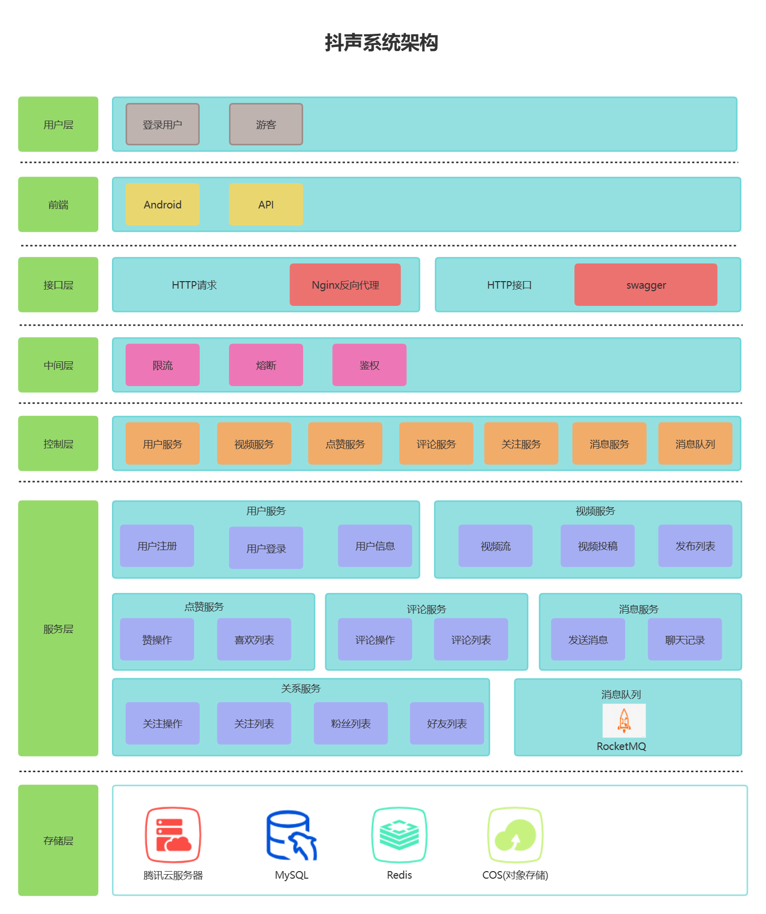
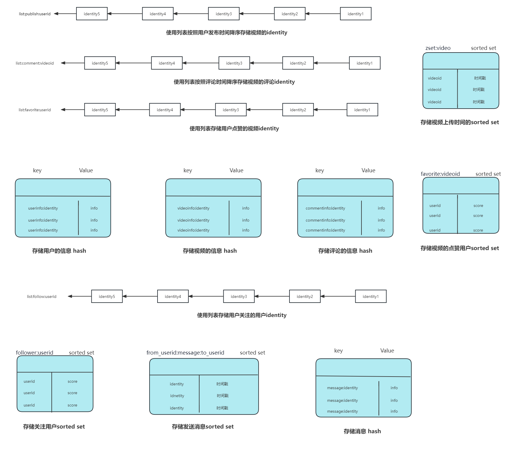

<p align="center">
    
<p>
  <p align="center">
    <br />
    <a href="https://github.com/jiangtianxia/simple_tiktok.git">查看本项目的文档 »</a>
    <br />
    <a href="https://ozilj01ufe.feishu.cn/base/bascnXyGKEcJi7vOkiVQVlPvoWc?table=tblOc75EZYVXCah0&view=vewMnpNgGD">查看团队工作文档 »</a>
    <br />
  </p>
  </p>

## **项目介绍**

实现极简版抖音服务端

## **目录**
- [上手指南](#上手指南)
    - [开发前的配置要求](#开发前的配置要求)
    - [安装步骤](#安装步骤)
    - [演示界面](#演示界面)
    - [演示视频](#演示视频)
- [文件目录说明](#文件目录说明)
- [开发的整体设计](#开发的整体设计)
   - [服务模块设计](#服务模块设计)
   - [整体的架构图](#整体的架构图)
   - [数据库的设计](#数据库的设计)
   - [Redis架构的设计](#Redis架构的设计)
   - [RocketMQ架构的设计](#RocketMQ架构的设计)
- [使用技术](#使用技术)
- [性能测试](#性能测试)
- [总结与反思](#总结与反思)
   - [目前仍存在的问题](#目前仍存在的问题)
   - [已识别出的优化项](#已识别出的优化项)
   - [架构演进的可能性](#架构演进的可能性)
   - [项目过程中的反思与总结](#项目过程中的反思与总结)
- [参与开源项目](#如何参与开源项目)
- [版本控制](#版本控制)
- [贡献者](#贡献者)
- [鸣谢](#鸣谢)

### **上手指南**

#### 配置要求

1. go 1.13(最低)
2. MySQL(配置文件位于config包中)
3. Redis、RocketMQ环境
4. [抖声客户端app](https://pan.baidu.com/s/194g4bi9ETFWiXEgPM5qDng?pwd=jtiu)

#### 安装步骤
1. 下载源码
2. 配置SSH、FTP、Redis、静态服务器地址等相关参数
3. 启动服务
4. 在客户端app配置相关地址服务端地址

```sh
git clone https://github.com/jiangtianxia/simple_tiktok.git
```
#### 演示界面
**基础功能演示**

//图片文件

**拓展功能演示**

//图片文件

**设置服务端地址**

//图片文件

#### 演示视频

//视频文件

### **文件目录说明**
//目录结构注释

```
simple_tiktok
├── config
├── controller
├── dao
│   ├── mysql
│   └── redis
├── docker
│   ├── mysql
│   ├── nginx
│   ├── redis
│   └── rocketmq
├── docs
├── images
├── logger
├── middlewares
├── models
├── rocketmq
├── router
├── service
├── sql
├── test
├── upload
├── utils
├── Dockerfile
├── go.mod
├── go.sum
├── main.go
└── README.md
```

### **开发的整体设计**

#### 整体的架构图

<p align="center">
    
<p>

#### 数据库的设计

<p align="center">
    
<p>

#### Redis架构的设计

<p align="center">
    
<p>

#### RocketMQ架构的设计

//图片文件

#### 服务模块设计

###### 用户模块的设计
用户模块包括用户注册、用户登录和用户信息获取三个部分，详情：[用户模块设计说明](https://ozilj01ufe.feishu.cn/docx/P4Asd72jsoQTvQxcDAhcVmlEnJg) 。

###### 点赞模块的设计
点赞模块包括xx。详情：[点赞模块设计说明]() 。

###### 评论模块的设计
评论模块包括xx。详情：[评论模块设计说明]() 。

###### 视频模块的设计
视频模块包括视频流、视频投稿、获取发布视频列表三个部分，详情：[视频模块设计说明](https://nn2h7776xm.feishu.cn/docx/BL80d9z7Qo5sZzxPqYjca5VLntd?from=space_persnoal_filelist)。

###### 消息模块的设计

消息模块包括xx。详情：[消息模块设计说明]() 。

###### 关系模块的设计
关注模块包括xx。详情：[关系模块设计说明]() 。

### **使用技术**
框架相关：
- [Gin](https://gin-gonic.com/docs/)
- [Gorm](https://gorm.io/docs/)

服务器相关：

//

中间件相关：
- [Redis](https://redis.io/docs/)
- [RocketMQ](https://rocketmq.apache.org/)

数据库：
- [MySQL](https://dev.mysql.com/doc/)

### **性能测试**

//

### **总结与反思**

#### 目前仍存在的问题

//

#### 已识别出的优化项

//

#### 架构演进的可能性

//

#### 项目过程中的反思与总结

//

### **参与开源项目**

贡献使开源社区成为一个学习、激励和创造的绝佳场所。你所作的任何贡献都是**非常令人感谢**的。

1. Fork the Project
2. Create your Feature Branch (`git checkout -b feature/AmazingFeature`)
3. Commit your Changes (`git commit -m 'Add some AmazingFeature'`)
4. Push to the Branch (`git push origin feature/AmazingFeature`)
5. Open a Pull Request

### **版本控制**

该项目使用Git进行版本管理。您可以在repository参看当前可用版本。

我们欢迎其他的贡献者参与此项目，在这之前，您需要遵循[Git 分支管理规范](https://ypbg9olvt2.feishu.cn/docs/doccnTMRmh7YgMwL2PgZ5moWUsd)和[注释规范](https://juejin.cn/post/7096881555246678046)。

### **贡献者**

- 江泽彬 https://github.com/jiangtianxia
- 裴君辉 https://github.com/paradoxskin
- 刘昕 https://github.com/TomiokapEace
- 张啸宇 https://github.com/TemplarX-boop
- 段欣悦 https://github.com/CynthiaZzzzzzzzz
- 徐龙 https://github.com/longxu0509

您也可以查阅仓库为该项目做出贡献的开发者。

### **鸣谢**

- [字节跳动后端青训营](https://youthcamp.bytedance.com/)
